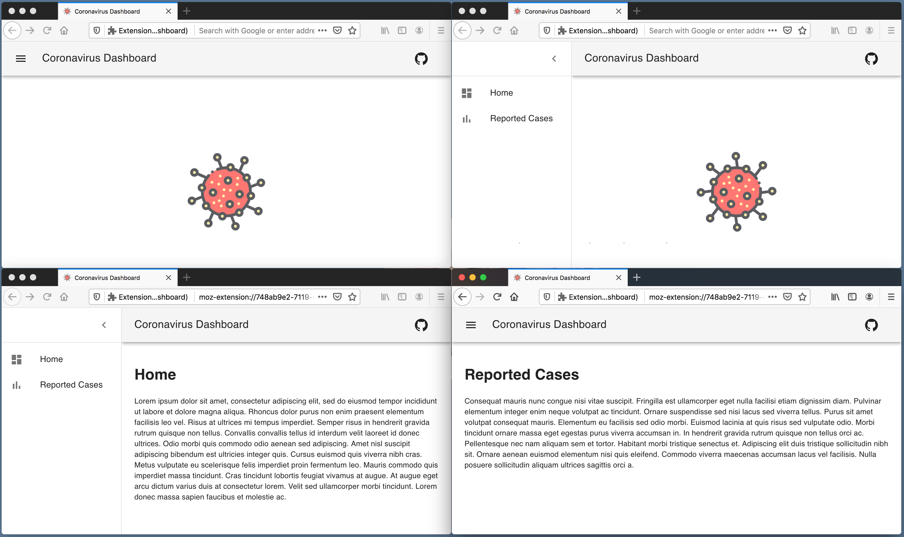

# coronavirus dashboard

> This project is currently a prototype, exploring [ReactJS](https://reactjs.org/) and [Material-UI](https://material-ui.com/).

# Overview

The COVID-19 pandemic in 2019 has created massive datasets on the <a href="https://covid-19-apis.postman.com/">Internet</a>. This project aims at providing a dashboard view for Coronavirus-related information when the user opens a new tab for both [Google Chrome](doc/chrome.png) or Mozilla Firefox browsers (below).



# Quick Start

1. `yarn`, Install dependencies for this project.

2. `yarn build`, Builds the app for production to the `build` folder, optimizing the build for the best performance.

3. Add the <a href="https://developer.chrome.com/extensions/getstarted">Google Chrome Extension</a> by pointing to the `build` folder from Step 1.

# Developing in Vagrant

```shell script
> cat /etc/redhat-release 
CentOS Linux release 7.6.1810 (Core) 

> yarn --version
1.22.4

> npm --version
6.14.4

> npx --version
6.14.4

> node --version
v13.13.0
```

If you do not have have the necessary development tools (above), the option to build and development in a Vagrant environment is available.

1. Execute: `vagrant up`

2. Execute: `vagrant ssh`

3. Navigate to `/vagrant` and you should be in this project directory within the guest server

4. Build and add the extension folder

# Yarn Commands

1. `yarn clean`: Remove any built artifacts.

2. `yarn` and `yarn install`: Install dependencies for this project.

3. `yarn build`: Builds the extension for production to the `build` folder, optimizing the build for the best performance.

4. `yarn dist`: Package the extension into a tar.gz file to the `dist` folder.

5. `yarn test`: Launches the test runner in the interactive watch mode, see [running tests](https://facebook.github.io/create-react-app/docs/running-tests).

6. `yarn eject`: This is a one-way operation - once you `eject`, you can not go back! (see notes below)

> If you are not satisfied with the build tool and configuration choices, you can `eject` at any time. This command will remove the single build dependency from your project. Instead, it will copy all the configuration files and the transitive dependencies (webpack, Babel, ESLint, etc) right into your project so you have full control over them. All of the commands except `eject` will still work, but they will point to the copied scripts so you can tweak them. At this point you are on your own. You do not have to ever use `eject`. The curated feature set is suitable for small and middle deployments, and you shouldn’t feel obligated to use this feature. However we understand that this tool wouldn’t be useful if you could not customize it when you are ready for it.

# References

1. <a href="https://covid-19-apis.postman.com/">Coronavirus</a> APIs collected by <a href="https://www.postman.com/">Postman</a>

2. <a href="https://www.iconfinder.com/icons/6002393/bacteria_corona_covid19_disease_microbe_virus_icon">Icons</a> provided by <a href="https://www.iconfinder.com/">IconFinder</a>

3. https://gist.github.com/danharper/8364399

4. Tutorial on Chrome extension background script by <a href="https://levelup.gitconnected.com/how-to-use-background-script-to-fetch-data-in-chrome-extension-ef9d7f69625d">Hu Chen</a>
